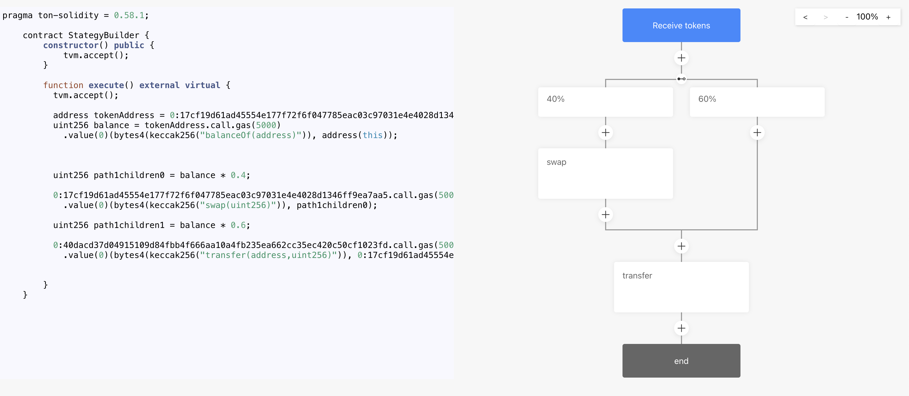
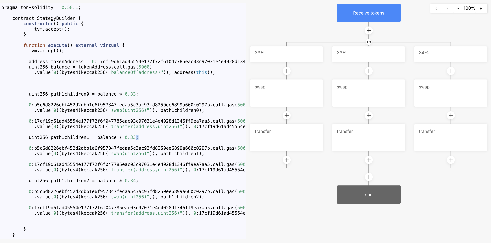
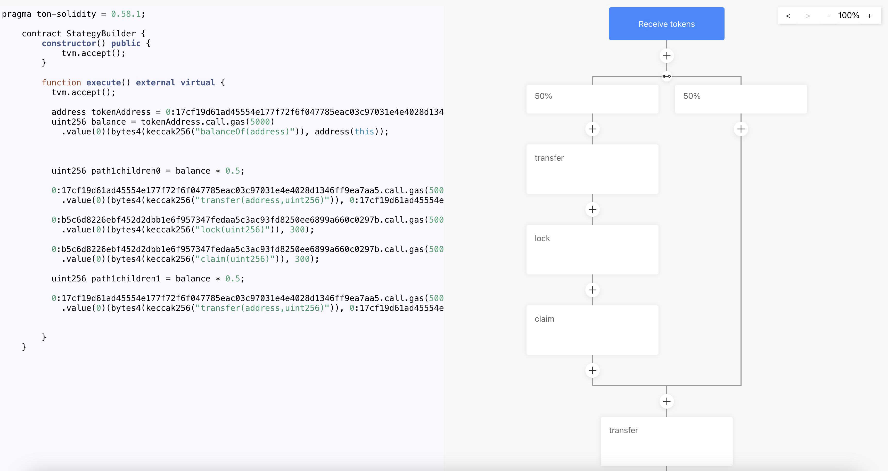

## Remixology

Remixology.app is a `Strategy builder` dApp that allows users to easily generate smart contract pipelines.

# Demo Video

https://youtu.be/uE9ktkM0nT0

# Try Demo

https://remixology.app

# Get started

Click the + button on any branch of the pipeline. You'll have 2 choices :

- `Add Split`: This creates a token split by splitting the pipeline into 2 branch. You can assign a percentage of the pipeline to each branch.

- `Add Command`: This creates a new command node on the pipeline. Click the command node to open the command drawer. Enter the address of the contract that should be called. Remixology assumes that every command you make is an inter-contract call to an already deployed contract such as a liquidity pool, an NFT collection , etc... Next enter the ABI of the targeted contract, Remixlogy will imediatly parse the ABI and display a selector allowing to choose the function you want to call. Depending on the function you choose, Remixology will display additional input field to fill in all the parameters of the funtion. Once you are done, click *Save* and the node will update on the pipeline.

Every time you modify something on the pipeline, note that the code area is also updating automatically and generating the code corresponding to your pipeline. The goal is for you to configure everything on the pipeline view then copy/paste the contract code into *everdev* to compile and deploy it. Note that this is still a very early alpha and some configurations might not compile properly.

# Test cases

Remixology is able to create the 3 pipelines presented in the Hackathon description:

- Case 1: receive token + swap a preconfigured portion of them + optionally send to preconfigured recipient address

- Case 2: receive token + swap to multiple tokens according to configuration + rebalancing logic + withdraw method

- Case 3: receive token + split in 50/50 proportion + provide liquidity to pool + receive LP + lock LP into farming pool + claim rewards method with optional recipient address

